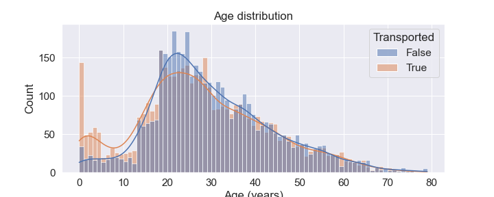
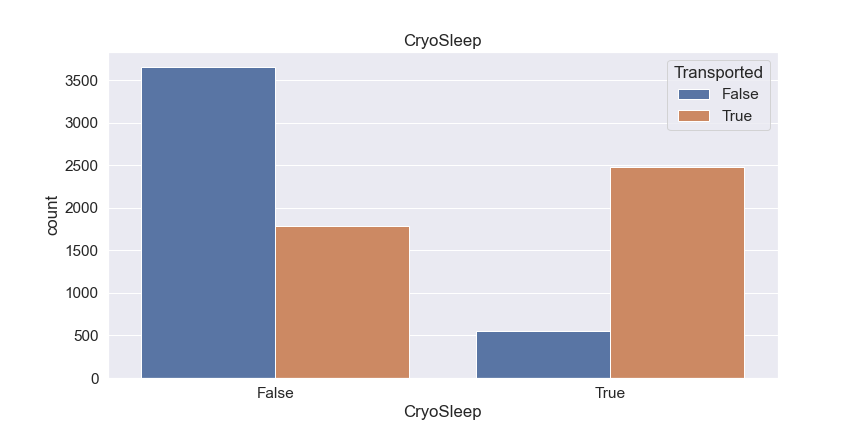
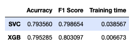
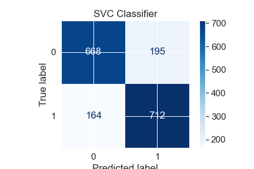
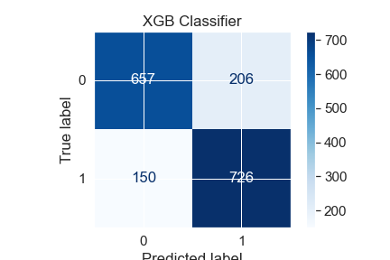
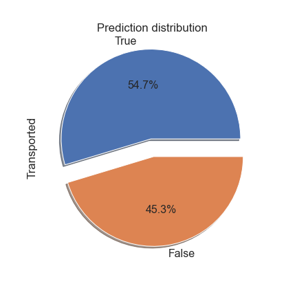

# Spaceship_Titanic

### Table of Contents
1. [Objective](#objective)
2. [Exploratory Data Analysis](#eda)
    1. [Spaceship Titanic Dataset](#dataset) 
    2. [Data Cleaning](#cleaning)
    3. [Feature Engineering](#engineering)
3. [Modeling](#model)
    1. [Models](#models)
    2. [Model Scoring](#tunning)
    3. [Scoring](#scoring)

## Objective 

Build a model that will predict if a passenger of the Spaceship Titanic was transported or not 

## Exploratory Data Analysis 

### Diamond Dataset 

PassengerId - A unique Id for each passenger. Each Id takes the form gggg_pp where gggg indicates a group the passenger is travelling with and pp is their number within the group. People in a group are often family members, but not always.

**HomePlanet** - The planet the passenger departed from, typically their planet of permanent residence.

**CryoSleep** - Indicates whether the passenger elected to be put into suspended animation for the duration of the voyage. Passengers in cryosleep are confined to their cabins.

**Cabin** - The cabin number where the passenger is staying. Takes the form deck/num/side, where side can be either P for Port or S for Starboard.
**Destination** - The planet the passenger will be debarking to.

**Age** - The age of the passenger.

**VIP** - Whether the passenger has paid for special VIP service during the voyage.

**RoomService, FoodCourt, ShoppingMall, Spa, VRDeck** - Amount the passenger has billed at each of the Spaceship Titanic's many luxury amenities.

**Name** - The first and last names of the passenger.

**Transported** - Whether the passenger was transported to another dimension. This is the target, the column you are trying to predict.

**Table 1**: Initial dataset 

### Principal Insights
1. Younger people were more likely to be transported
2. Most people don´t spend
3. People who come from Earht are less likely to be transported, contrary over people who come from Europa and Mars
4. The most notorious correlation with whether they were transported or not is the CryoSleep.

**Image 1**: Age Group Distribution 

**Image 2**: Cryo Sleep Distribution 

### Data Cleaning 

The dataset needed to be cleaned in almost every feature, imputing missing values, looking for outliers, etc. 

We tried to impute the values with correlated variables, when this was not possible we did it through the mode and the median 

### Feature Engineering 

Some features will need to be engineered to prepare for model building. The transformations that we applied were:

- Create a new feature that summarize the total of the expenditure and a flag if doesn´t spend anything
- Extract the group of the passenger Id
- Create Age Groups
- Scale numeric values
- Encode categorical features

## Modelling 

### Models 

After the preprocessing, we tried diferent models so we can watch what kind fit better in the data:

KNeighborsClassifier
DecisionTreeClassifier
LogisticRegression
SVC
RandomForestClassifier
XGBClassifier

**Table 2**: Scores and performance

|                         |    Score |    Time       |
|:------------------------|---------:|--------------:|
| KNeighborsClassifier    | 0.768832 | 0.00382298    |
| DecisionTreeClassifier  | 0.729154 | 0.00042553    |
| LogisticRegression      | 0.786083 | 0.0008246     | 
| SVC                     | 0.792409 | 0.03856717    |
| RandomForestClassifier  | 0.780333 | 0.00869237    |
| XGBClassifier           | 0.794709 | 0.006673      |

The models that has a better performance was svc and xgb, so we will use to start tunning (SVC is the worst about the training time, but how this is not a large dataset, that won´t be a problem)

### Model tunning 

To find the optimal parameters, we used a Grid search with diferent combinations and using cross validation. Here are the best parameters that were find:

### Scoring 
 
We are going to use three different scoring metrics to evaluate the model:

**Accuracy**: Is the ratio of correct predictions. Sometimes this is not the best measure, expecially when we are dealing with skewed datasets (this is not the case), so we can´t find a problem using it here.

**Consusion matrix**: The general idea is to count the number of times instances of class A (Transported) are classified as class B (Not transported), and viceversa.

**F1 Score**: F1 Score is the weighted average of Precision and Recall. Therefore, this score takes both false positives and false negatives into account.

**Table 3**: Accuracy, F1 Score and time

**Image 3**: Confusion Matrixs 

We can see that the XGBClassifier has the better performance, so we will use it and train it in the whole train data, so we can predict in the test set.

The final prediction distribution that we will submit to the competition is similar with the train set, so we can finally do it.

**Image 3**: Predict distribution

